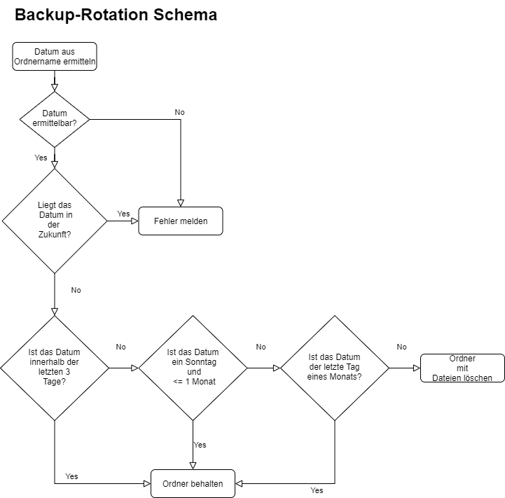
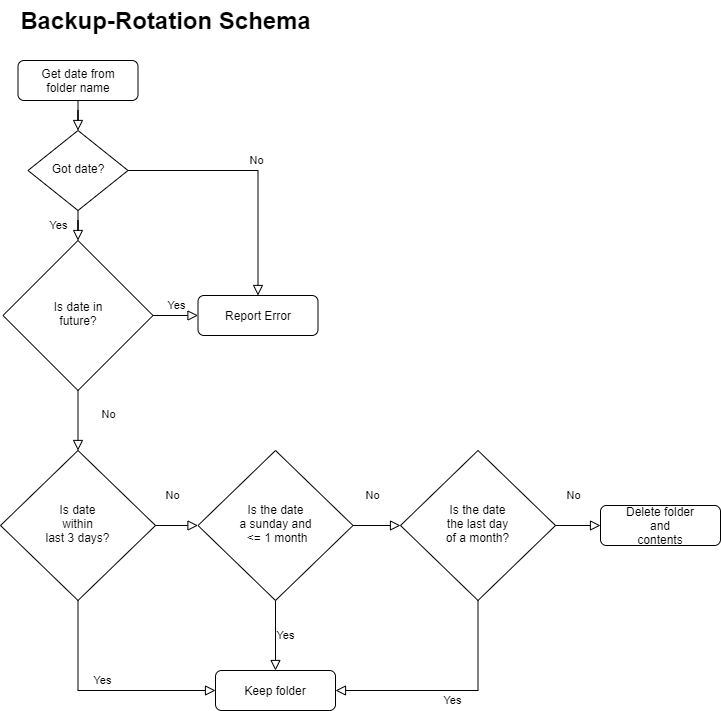

# MindfavBackupTools

English/Deutsch
This documentation is written in 2 languages: german and englisch.
Diese Dokumentation ist in zwei Sprachen geschrieben: Deutsch und Englisch.

## Deutschsprachige Dokumentation - Documentation in German

Eine Reihe von Tools zum Arbeiten mit Backups. Im ersten Schritt werde ich Kommandos zum Rotieren von Backups schreiben.
Die Anwendung wir din C# mit Visual Studio 2022 unter .NET 6 geschrieben.

### Befehle

#### set

Dieser Befehl aktualisiert eine Einstellung in applicationConfiguration.json.
Verfügbare Einstellungen:

* RotationFoldersDateCultureInfo 
Speichert das Format, in dem das Program Datumsangaben erwartet (en-US für YYYY-mm-dd; de-DE für dd.MM.YYYY).

#### rotate

Dieser Befehl rotiert Backups. Rotation bedeutet hier, dass ältere Backups gelöscht werden.
Es gibt viele verschiedene Ansätze zum Rotieren von Backups. Für tiefere Einblicke, empfehle ich diesen Wikipedia Artikel als Einstiegspunkt ins Thema:
https://en.wikipedia.org/wiki/Backup_rotation_scheme

Dieses Tool arbeitet nach dem folgenden Schema:

1. Behalte immer die drei aktuellsten Backups.
Ältere Backups werden entfernt.

2. Behalte immer das letzte Backup einer Woche - und das über die letzten 4 Wochen hinweg.
Es gibt also immer Backups 4 Wochen in der Zeit zurück.

3. Behalte immer das letzte Backup des letzten Monats.
Das Tool behält also Backups über eine längere Zeit,
eines für jeden Monat.

Dieser Ansatz kann dazu führen, dass gerade bei großen Backup-Dateien über längere Zeit viel Speicherplatz verbraucht wird.

## Documentation in english, Englischsprachige Dokumentation

A set of tools for working with backups. In a first step, I will add a command to rotate backups.
Application written in C# within Visual Studio 2022, using .NET 6.

### Commands

#### set

This command updates a setting in applicationConfiguration.json.
Available settings:

* RotationFoldersDateCultureInfo 
Sets the format, the program expects dates in (en-US for YYYY-mm-dd; de-DE for dd.MM.YYYY).

#### rotate

This command will rotate backups. Rotation here means, it will delete old backups.
There are many different ideas about backup rotation. For a deeper dig, I suggest this wikipedia entry as a starting point:
https://en.wikipedia.org/wiki/Backup_rotation_scheme

I took a decision for the following sheme:

1. Keep 3 most up-to-date backups
Remove older backups

2. Keep last backup of last week for a whole month.
So there are backups for the last 4 weeks.

3. Always keep the last backup of a month.
So this tool does keep backups over a longer time,
one for every month.

This approach can fill disks. So be careful about it.

